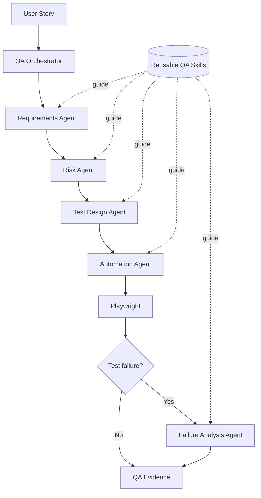

# Agentic Quality Engineering Demo

A portfolio-ready experiment showing how specialized QA agents can move a complex User Story from ambiguity discovery to risk-based Playwright automation and real execution evidence.

This is not only a Playwright framework. The central idea is that **agents own QA decisions**, **skills provide reusable QA capabilities**, and **tools execute work and preserve evidence**.

## Problem

Generating tests before clarifying requirements can automate the wrong behavior. Financial workflows make that especially dangerous: rounding, retries, concurrency, asynchronous providers, discounts, and partial outcomes can create real loss.

This repository demonstrates a Shift-Left alternative:

1. expose missing requirements;
2. prioritize business and technical risk;
3. design traceable scenarios;
4. automate only objective behavior;
5. investigate failures before declaring product defects;
6. preserve real execution evidence.

## Architecture



The [QA Orchestrator](agents/qa-orchestrator.md) routes work to the smallest useful set of specialists. It does not silently perform every QA responsibility itself.

## Agents

| Agent | Decision ownership |
|---|---|
| [QA Orchestrator](agents/qa-orchestrator.md) | Workflow decomposition, routing, dependencies, and final synthesis |
| [Requirements Agent](agents/requirements-agent.md) | Business rules, ambiguities, Product questions, and affected functionality |
| [Risk Agent](agents/risk-agent.md) | Business, technical, integration, regression, concurrency, and consistency risk |
| [Test Design Agent](agents/test-design-agent.md) | Risk-prioritized scenarios and requirement traceability |
| [Automation Agent](agents/automation-agent.md) | What is safe and valuable to automate with Playwright |
| [Failure Analysis Agent](agents/failure-analysis-agent.md) | Evidence-based classification of failed tests |

Additional API, UI, PR, accessibility, and performance specialists are available under [`agents/`](agents/).

## Skills

Skills hold QA methodology once so agents do not duplicate it:

- [`requirement-analysis`](skills/requirement-analysis/SKILL.md)
- [`risk-analysis`](skills/risk-analysis/SKILL.md)
- [`test-design`](skills/test-design/SKILL.md)
- [`playwright-testing`](skills/playwright-testing/SKILL.md)
- [`failure-investigation`](skills/failure-investigation/SKILL.md)
- [`bug-reporting`](skills/bug-reporting/SKILL.md)
- [`api-testing`](skills/api-testing/SKILL.md)

The distinction is intentional:

- **Agent:** specialized responsibility and decision boundary.
- **Skill:** reusable QA knowledge and procedure.
- **Tool:** external execution capability, such as Playwright and Chromium.

## Demo User Story

> As a customer, I want to request a full or partial refund for a purchase so that I can recover the corresponding amount for products I no longer want to keep.

The scenario includes multiple sellers, eligibility periods, product/cart discounts, optional shipping refunds, card plus internal-credit payment, asynchronous processing, multiple partial refunds, a paid-total ceiling, and idempotent retries.

The [requirement analysis](test-plans/refund-requirement-analysis.md) deliberately leaves unresolved rules unresolved. The demo does not invent discount allocation, shipping, eligibility boundaries, fractional-cent rounding, seller aggregation, provider reconciliation, or true concurrency behavior.

## Risk-based test strategy

The highest risks are:

- cumulative refunds exceeding the amount paid;
- incorrect card/internal-credit allocation;
- duplicate refunds after retries;
- stale checks during concurrent refund requests;
- provider timeouts with an unknown financial outcome.

See the complete [risk assessment](test-plans/refund-risk-assessment.md) and [test plan](test-plans/refund-test-plan.md).

The automation boundary is documented in [refund-automation-strategy.md](test-plans/refund-automation-strategy.md). Six Critical/High scenarios are automated because their outcomes are explicit and deterministic. Six further scenarios remain blocked by requirement ambiguity or missing production-like integrations.

## Playwright automation

The local test surface in [`app/`](app/) is intentionally small and deterministic. It is not presented as a production refund implementation. Its fixed fixture is USD 120.00 paid as USD 90.00 card plus USD 30.00 internal credit, avoiding an invented fractional-cent rule.

Automated coverage:

| Test | Priority | Layer | Verified behavior |
|---|---|---|---|
| RF-T01 | Critical | UI | Full refund at the paid-total boundary |
| RF-T02 | High | UI | Exact-divisible proportional partial refund |
| RF-T03 | Critical | API | Cumulative partial-refund ceiling |
| RF-T04 | Critical | API | Retry idempotency and single side effect |
| RF-T05 | Critical | API | Over-refund rejection without mutation |
| RF-T06 | High | API | State belongs to the accepted state model |

Tests live in [`tests/refund/`](tests/refund/). Titles carry test, priority, and risk IDs for traceability.

## Failure investigation

A failed test is never automatically a product bug. The Failure Analysis Agent classifies it as Product defect, Automation defect, Test data issue, Environment issue, or Requirement ambiguity.

The first browser run in this workspace produced a real environment failure because sandboxed execution could not access the installed Chromium binary. API checks passed, the browser checks failed before application interaction, and an authorized browser run then passed all six tests. The investigation is preserved in [`reports/failure-investigation-2026-08-26.md`](reports/failure-investigation-2026-08-26.md).

## Run the demo

Prerequisites: Node.js 20+ and npm.

```bash
npm install
npx playwright install chromium
```

Run the full suite:

```bash
npm test
```

Run visibly in Chromium:

```bash
npm run test:headed
```

Use Playwright UI mode:

```bash
npm run test:ui
```

Run only the headed ecommerce showcase, record its video, and regenerate Allure:

```bash
npm run test:portfolio
```

Open the last HTML report:

```bash
npm run test:report
```

Generate a real Allure report from a fresh execution:

```bash
npm run test:allure
npm run allure:open
```

Run quality checks:

```bash
npm run lint
npm run typecheck
npm run build
```

Run one portfolio-friendly scenario:

```bash
npx playwright test tests/refund/full-refund.spec.ts --headed
```

## Real evidence

Every `npm test` run creates:

- HTML report: `reports/playwright-html/index.html`
- Allure raw results: `allure-results/`
- Generated Allure report: `reports/allure/index.html`
- JSON result metadata: `evidence/execution-results.json`
- Failure artifacts: `test-results/<test-name>/`
- Traces: retained on failure as `trace.zip`
- Screenshots: captured only on failure
- Videos: retained only on failure

`npm run test:portfolio` uses a separate headed project with portfolio-only pacing. It produces a canonical recording at `evidence/videos/ecommerce-showcase.webm`, a run-owned artifact under `test-results/`, and an isolated report at `reports/allure-portfolio/index.html` without replacing the historical Allure report.

The latest verified summary is [`reports/execution-summary.md`](reports/execution-summary.md). Generated HTML, JSON, traces, screenshots, and videos are ignored by Git by default because they are environment-specific; the curated `ecommerce-showcase.webm` is the single versioned exception. See [`evidence/README.md`](evidence/README.md) and the [portfolio evidence guide](docs/portfolio-evidence.md).

The generated Allure dashboard is published automatically through GitHub Pages after pushes to `main`. Once the workflow completes, use the repository's **Settings → Pages** URL as the portfolio link for the interactive report.

## Project structure

```text
qa-agents-demo/
|-- agents/                  # Specialized decision-making prompts
|-- skills/                  # Reusable QA capabilities
|-- app/                     # Deterministic local refund test surface
|-- tests/refund/            # Playwright TypeScript tests
|-- test-plans/              # Requirements, risks, scenarios, decisions
|-- reports/                 # Human-readable summaries + generated HTML
|-- evidence/                # Generated machine-readable execution evidence
|-- docs/                    # Portfolio handoff guidance
|-- AGENTS.md                # Repository-wide QA policy
|-- playwright.config.ts
|-- tsconfig.json
`-- package.json
```

## GitHub guidance

Commit source, agent/skill definitions, QA reasoning, tests, configuration, lockfile, and concise Markdown summaries.

Do not commit `node_modules/`, `test-results/`, generated HTML reports, machine-specific JSON results, videos, screenshots, traces, secrets, or customer data. Publish selected generated evidence separately only when its provenance and privacy have been reviewed.
